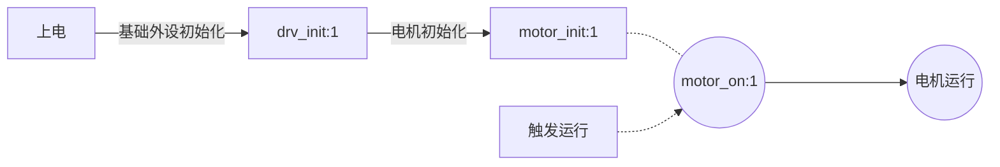

# 运行流程

当发生错误的时候，motor_on会置0，由安全任务负责将pwm关闭，

当需要开启电机时候，调用对外函数 motor_start 启动电机或者 motor_on 置1，同时调用pwm_start手动开启

## 流程概览

```mermaid
flowchart LR
	motor_run((电机运行))
    motor_on((motor_on:1))
    上电--基础外设初始化-->drv_init:1 --电机初始化--> motor_init:1 -.- motor_on---->motor_run
    触发运行-.->motor_on

```

## 流程细分

### 基础外设初始化

```mermaid
flowchart LR
    基础外设初始化开始-->储存参数初始化-->调试串口初始化-->编码器外设初始化--> 基础外设初始化完成
```

### 电机初始化

```mermaid
flowchart LR
    电机初始化start-->初始化电机配置参数-->编码器初始化-->编码器参数标定-->电机参数标定--> 电机初始化完成
```

### 电机初始化

```mermaid
flowchart LR
    电机初始化start--基础外设初始化-->drv_init:1 --电机初始化--> 电机初始化完成
```

